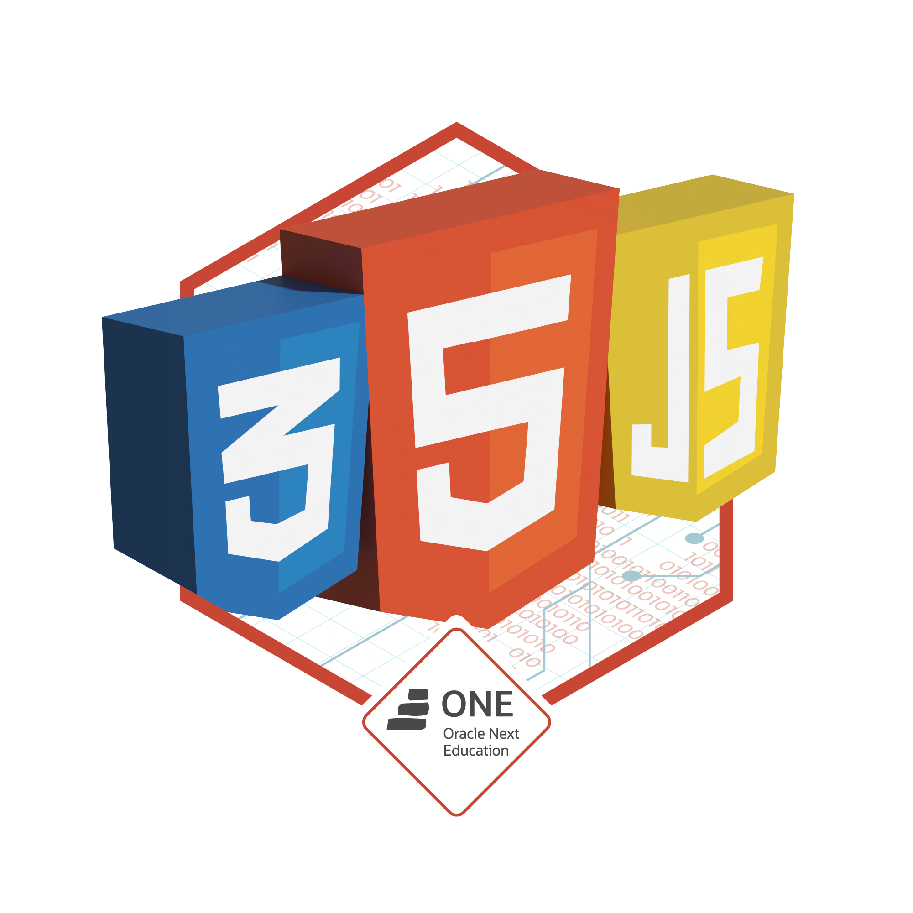

<h1> Hello World 👋🌎 </h1>

- 📚 Pós-graduação em Desenvolvimento Full Stack em andamento / Post Graduate in Full Stack Development (Software Engineer) in progress.
- 🌱 Atualmente aprendendo Mensagerias / I’m currently learning Message Queue.
- ☕ Projeto em andamento: Microsserviço Hotel Alura com Spring Boot e Spring Cloud/ Actually working on the project: Hotel Alura Microservice with Spring Boot and Spring Cloud
- 📫 Para entrar em contato comigo: email ou clique nos meus github stats / How to reach me: email or click on my github stats.

##

  <a href="https://www.linkedin.com/in/menezesguilherme/">
  
   
  

   
  
  
 
    
    
    
    
    
  

  
  <h3>Badges Oracle Next Education:</h3>
   
  
 
    <h4>Primeiro desafio:</h4>
    
    <h4>Segundo desafio:</h4>
    
    <h4>Terceiro desafio:</h4>
    
    <h4>Quarto desafio:</h4>
    
    <h4>Quinto desafio:</h4>
    
    <h4>Sexto desafio:</h4>
    
  

