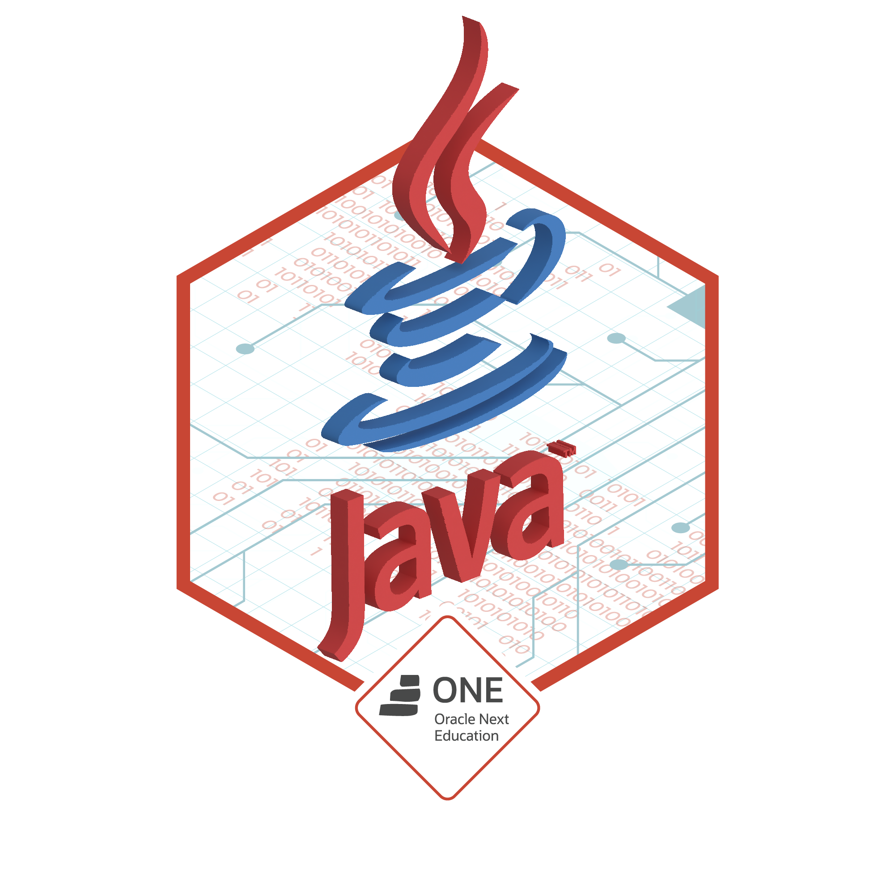

### Hello World 👋🌎

- 🌱 Atualmente aprendendo Kotlin / I’m currently learning Kotlin.
- ☕ Projeto em andamento: Hotel Alura / Actually working on the project: Hotel Alura
- - 📫 Para entrar em contato comigo: email ou linkedin / How to reach me: email or linkedin.
- 📚 Aqui no meu github eu posto todos os projetos ou desafios requisitados elaborados por mim, fora os projetos realizados em cursos / Here in my github, I post all my personal projects or challenges that was requested, apart from the projects done in courses. 

##

  <a href="https://www.linkedin.com/in/menezesguilherme/">
  
   
  

   
  

 
  
  
  
  
  

  
### Badges Oracle Next Education:
  
#### Primeiro desafio:

 
#### Segundo desafio:

#### Terceiro desafio:

#### Quarto desafio:

#### Quinto desafio:

